# Google Ads Conversions API - Documentación Completa

## 📋 Información General

Esta API permite registrar conversiones de Google Ads para el cliente **ENTEL Peru**. El endpoint acepta parámetros tanto por URL (obligatorios) como por JSON body (opcionales).

**Versión:** 1.0  
**Fecha de Implementación:** 2025-01-02  
**Cliente:** ENTEL Peru  
**Fuente:** Google Ads  

---

## 🌐 Endpoints Disponibles

### 1. Registrar Conversión (POST)

Registra una nueva conversión de Google Ads.

**URL:**
```
POST https://core-service-stg-XXXXX.run.app/service/v1/google/conversion/:apikey/:tracking
```

**Parámetros de URL (OBLIGATORIOS):**

| Parámetro | Tipo   | Descripción | Ejemplo |
|-----------|--------|-------------|---------|
| `apikey`  | string | API Key del cliente (debe existir en Redis) | `abc123def456` |
| `tracking`| string | Código único de tracking de la conversión | `TRK-20250102-001` |

**Headers:**
```http
Content-Type: application/json
```

**Body JSON (OPCIONALES - todos los campos):**

```json
{
  "msisdn": "51987654321",
  "id_product": "PROD-ENTEL-123",
  "empello_token": "uknfebhjcwtmvngwoubdszyycvltwuwicitgufabsaryejrgopelsyqzltlwtlnf",
  "campaign": "Juegos1"
}
```

| Campo | Tipo | Max Length | Descripción |
|-------|------|------------|-------------|
| `msisdn` | string | 20 | Número de teléfono del usuario (formato: código país + número) |
| `id_product` | string | 255 | Identificador del producto |
| `empello_token` | string | 255 | Token de Empello para tracking adicional |
| `campaign` | string | 255 | Nombre de la campaña publicitaria |

**Importante:**
- ✅ Los parámetros de URL (`apikey`, `tracking`) son **OBLIGATORIOS**
- ℹ️ Los campos del JSON body son **OPCIONALES**
- ℹ️ Si no se envía body JSON, se procesan solo los parámetros de URL
- ℹ️ Si se envía body JSON incompleto, se procesan solo los campos presentes

---

## 📝 Ejemplos de Uso

### Ejemplo 1: Solo parámetros obligatorios (sin body)

```bash
curl -X POST "https://core-service-stg-XXXXX.run.app/service/v1/google/conversion/abc123def456/TRK-20250102-001" \
  -H "Content-Type: application/json"
```

### Ejemplo 2: Con todos los campos opcionales

```bash
curl -X POST "https://core-service-stg-XXXXX.run.app/service/v1/google/conversion/abc123def456/TRK-20250102-002" \
  -H "Content-Type: application/json" \
  -d '{
    "msisdn": "51987654321",
    "id_product": "PROD-ENTEL-123",
    "empello_token": "uknfebhjcwtmvngwoubdszyycvltwuwicitgufabsaryejrgopelsyqzltlwtlnf",
    "campaign": "Juegos1"
  }'
```

### Ejemplo 3: Solo algunos campos opcionales

```bash
curl -X POST "https://core-service-stg-XXXXX.run.app/service/v1/google/conversion/abc123def456/TRK-20250102-003" \
  -H "Content-Type: application/json" \
  -d '{
    "msisdn": "51987654321",
    "campaign": "Juegos1"
  }'
```

### Ejemplo 4: PowerShell

```powershell
$headers = @{
    "Content-Type" = "application/json"
}

$body = @{
    msisdn = "51987654321"
    id_product = "PROD-ENTEL-123"
    empello_token = "uknfebhjcwtmvngwoubdszyycvltwuwicitgufabsaryejrgopelsyqzltlwtlnf"
    campaign = "Juegos1"
} | ConvertTo-Json

$response = Invoke-RestMethod `
    -Uri "https://core-service-stg-XXXXX.run.app/service/v1/google/conversion/abc123def456/TRK-20250102-004" `
    -Method POST `
    -Headers $headers `
    -Body $body

Write-Host "Response: $($response | ConvertTo-Json -Depth 10)"
```

---

## ✅ Respuestas de la API

### Respuesta Exitosa (200 OK)

```json
{
  "success": true,
  "message": "Conversion registered successfully",
  "data": {
    "conversion_id": 12345,
    "tracking": "TRK-20250102-001",
    "customer": "ENTEL Peru",
    "country": "pe",
    "operator": "entel",
    "conversion_date": "2025-01-02T10:30:00.000Z",
    "response_time_ms": 145,
    "msisdn": "51987654321",
    "id_product": "PROD-ENTEL-123",
    "empello_token": "uknfebhjcwtmvngwoubdszyycvltwuwicitgufabsaryejrgopelsyqzltlwtlnf",
    "campaign": "Juegos1"
  }
}
```

**Nota:** Los campos opcionales (`msisdn`, `id_product`, `empello_token`, `campaign`) solo aparecen en la respuesta si fueron proporcionados en el request.

### Error: API Key Inválida (401 Unauthorized)

```json
{
  "success": false,
  "error": "Invalid API key",
  "code": "INVALID_APIKEY"
}
```

### Error: Tracking Duplicado (409 Conflict)

```json
{
  "success": false,
  "error": "Conversion with this tracking already exists",
  "code": "DUPLICATE_TRACKING"
}
```

### Error: Validación de Body (400 Bad Request)

```json
{
  "success": false,
  "error": "msisdn must be a valid phone number string (max 20 characters)",
  "code": "INVALID_BODY"
}
```

### Error: Tracking Vacío (400 Bad Request)

```json
{
  "success": false,
  "error": "Tracking parameter is required",
  "code": "MISSING_TRACKING"
}
```

### Error del Servidor (500 Internal Server Error)

```json
{
  "success": false,
  "error": "Internal server error",
  "code": "CONVERSION_ERROR",
  "response_time_ms": 89
}
```

---

## 🔍 Endpoint de Consulta de Estado

### Consultar Estado de Conversión (GET)

**URL:**
```
GET https://core-service-stg-XXXXX.run.app/service/v1/google/conversion/status/:tracking
```

**Parámetros:**

| Parámetro | Tipo   | Descripción |
|-----------|--------|-------------|
| `tracking`| string | Código único de tracking de la conversión |

**Ejemplo de Request:**
```bash
curl -X GET "https://core-service-stg-XXXXX.run.app/service/v1/google/conversion/status/TRK-20250102-001"
```

**Respuesta Exitosa (200 OK):**
```json
{
  "success": true,
  "data": {
    "tracking": "TRK-20250102-001",
    "status_post_back": 1,
    "date_post_back": "2025-01-02T10:35:00.000Z",
    "conversion_date": "2025-01-02T10:30:00.000Z",
    "customer": "ENTEL Peru",
    "country": "pe",
    "operator": "entel"
  }
}
```

**Estados del PostBack:**
- `0` = Pending (pendiente)
- `1` = Success (exitoso)
- `2` = Error

---

## 📊 Flujo de Procesamiento

```mermaid
graph TD
    A[Request POST] --> B{Validar API Key}
    B -->|Inválida| C[401 Unauthorized]
    B -->|Válida| D{Validar Tracking}
    D -->|Vacío| E[400 Bad Request]
    D -->|Duplicado| F[409 Conflict]
    D -->|Válido| G{¿Tiene Body JSON?}
    G -->|No| H[Procesar solo URL params]
    G -->|Sí| I{Validar Body}
    I -->|Inválido| J[400 Bad Request]
    I -->|Válido| K[Procesar URL + Body]
    H --> L[Crear Conversión en DB]
    K --> L
    L --> M[Enviar a Cola PostBack]
    M --> N[200 OK + Datos]
```



---

## 🔐 Seguridad

1. **API Key:** Todas las requests deben incluir una API Key válida en la URL
2. **HTTPS:** Todas las comunicaciones deben ser por HTTPS
3. **Rate Limiting:** (por implementar) Máximo X requests por minuto por API Key
4. **Validación:** Todos los campos del body JSON son validados antes de procesarse

---

## 🗄️ Estructura de Base de Datos

Tabla: `staging.conversions`

```sql
CREATE TABLE staging.conversions (
  id                BIGSERIAL PRIMARY KEY,
  conversion_date   TIMESTAMP NOT NULL DEFAULT NOW(),
  customer_id       BIGINT NOT NULL,
  tracking          VARCHAR(500) NOT NULL,
  id_product        VARCHAR(255),           -- OPCIONAL
  msisdn            VARCHAR(20),            -- OPCIONAL
  empello_token     VARCHAR(255),           -- OPCIONAL
  source            VARCHAR(50) NOT NULL DEFAULT 'google',
  status_post_back  SMALLINT,
  date_post_back    TIMESTAMP,
  campaign          VARCHAR(255),           -- OPCIONAL
  country           VARCHAR(10),
  operator          VARCHAR(50),
  
  FOREIGN KEY (customer_id) REFERENCES customers(id_customer) ON DELETE CASCADE
);
```

**Índices:**
- `idx_conversions_tracking` en `tracking`
- `idx_conversions_customer` en `customer_id`
- `idx_conversions_date` en `conversion_date`
- `idx_conversions_status` en `status_post_back`

---

## 🚀 Deployment

### Staging
```bash
gcloud builds submit --config=cloudbuild-core-stg.yaml .
```

**URL Staging:**
```
https://core-service-stg-XXXXX.run.app
```

### Production
```bash
gcloud builds submit --config=cloudbuild-core-prod.yaml .
```

**URL Production:**
```
https://core-service-prod-XXXXX.run.app
```

---

## 🧪 Testing

### Script de Testing PowerShell

Ver archivo: `test-google-conversions.ps1`

```powershell
# Ejecutar test completo
.\test-google-conversions.ps1

# Test solo con URL params
.\test-google-conversions.ps1 -OnlyUrlParams

# Test con body completo
.\test-google-conversions.ps1 -WithFullBody
```

---

## 📞 Soporte

Para cualquier duda o problema:
- **Email:** dev@xafra-ads.com
- **Documentación Técnica:** `MASTER_DOCUMENTATION.md`
- **Logs:** Cloud Logging en GCP

---

## 📝 Changelog

### v1.0 - 2025-01-02
- ✅ Implementación inicial del endpoint POST
- ✅ Parámetros obligatorios por URL (apikey, tracking)
- ✅ Parámetros opcionales por JSON body (msisdn, id_product, empello_token, campaign)
- ✅ Validación completa de todos los campos
- ✅ Integración con PostBack Queue
- ✅ Endpoint de consulta de estado (GET)
- ✅ Documentación completa
- ✅ Scripts de testing

---

**Última actualización:** 2025-01-02  
**Versión del documento:** 1.0
